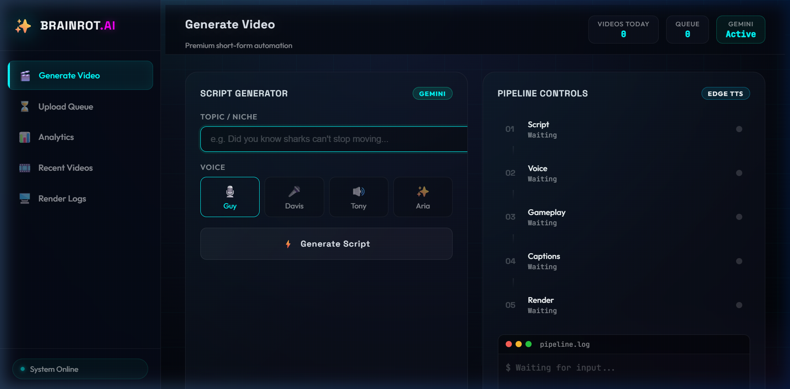
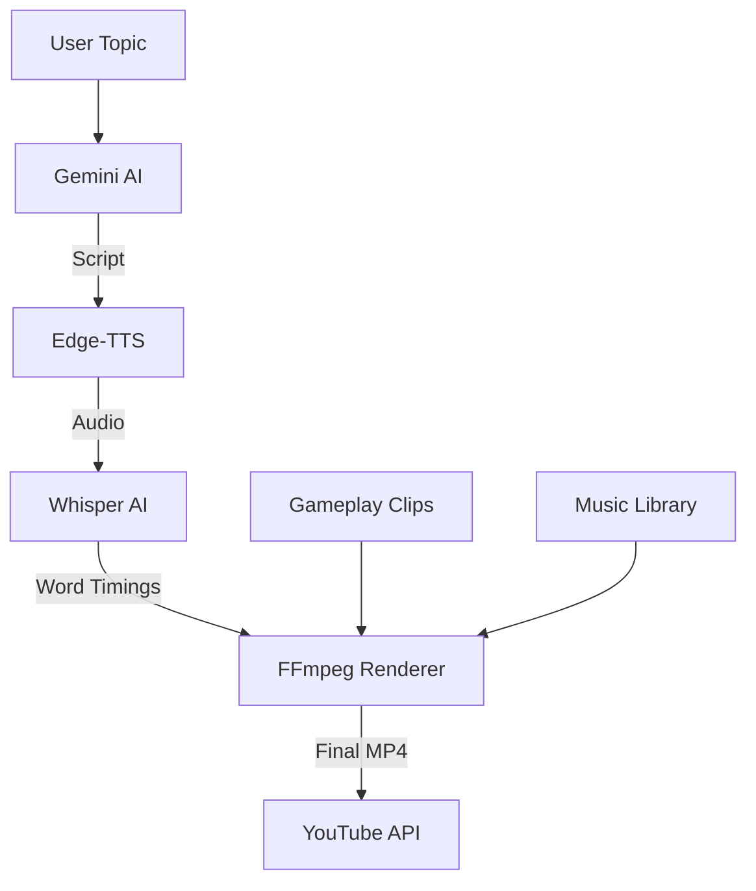

# 🧠 BRAINROT.AI
### *The Ultimate AI-Powered YouTube Shorts Automation Studio*

[](https://www.python.org/downloads/)
[](https://flask.palletsprojects.com/)
[](https://ai.google.dev/)
[](https://opensource.org/licenses/MIT)

**Brainrot.ai** is a production-grade automation pipeline designed to generate viral-ready YouTube Shorts from a single topic. It orchestrates script generation, high-fidelity voice synthesis, dynamic gameplay selection, and word-level highlighted captions into a seamless, high-speed rendering process.

---

## 📺 Dashboard Preview



---

## ✨ Key Features

- ⚡ **Seamless Pipeline**: Topic ➔ Script ➔ Voice ➔ Gameplay ➔ Subtitles ➔ Render.
- 🤖 **Gemini-Powered Scripts**: Intelligent scripting tailored for viral hooks and engagement.
- 🎙️ **Edge-TTS Integration**: High-quality, natural-sounding voiceovers (Multiple personas: Guy, Davis, Tony, Aria).
- 🎮 **Dynamic Gameplay Selection**: Automatically picks and vertical-crops random gameplay clips from your library.
- ✍️ **Word-Level Subtitles**: High-speed caption synchronization with professional styling (Grobold font).
- 📤 **YouTube Auto-Upload**: Direct integration with YouTube Data API v3 for one-click publishing.
- 🎨 **Modern Cyberpunk UI**: Sleek, glassmorphic dashboard for managing the entire studio.

---

## 🛠️ Architecture



---

## 🚀 Quick Start

### 1. Prerequisites
- Python 3.8+
- [FFmpeg](https://ffmpeg.org/download.html) installed and added to PATH.

### 2. Installation
```bash
# Clone the repository
git clone https://github.com/Hyper00W/Brainrot-AI.git
cd Brainrot-AI

# Create and activate virtual environment
python -m venv venv
source venv/bin/activate  # On Windows: venv\Scripts\activate

# Install dependencies
pip install -r requirements.txt
```

### 3. Configuration
1. Create a `.env` file based on `.env.example`:
   ```env
   GEMINI_API_KEY=your_api_key_here
   SECRET_KEY=your_secret_key
   ```
2. Place `client_secrets.json` (from Google Cloud Console) in the root directory for YouTube uploads.
3. Add gameplay clips (`.mp4`) to `assets/gameplay/` and background music (`.mp3`) to `assets/music/`.

### 4. Run Launch
```bash
python app.py
```
Visit `http://localhost:5000` to start creating.

---

## 📂 Project Structure

- `app.py`: Flask application and API controller.
- `modules/`:
    - `script_generator.py`: GPT/Gemini prompt engineering.
    - `voice_generator.py`: Edge-TTS audio synthesis.
    - `caption_generator.py`: Whisper-based word-level transcription.
    - `gameplay.py`: Clip selection and FFmpeg vertical cropping.
    - `renderer.py`: Advanced FFmpeg filter-complex assembly.
    - `uploader.py`: YouTube Data API integration.
- `templates/`: Cyberpunk dashboard frontend.

---

## 📜 Documentation

For detailed walkthroughs on specific modules or setup guides, please refer to the [Wiki](https://github.com/Hyper00W/Brainrot-AI/wiki) (coming soon).

## 🤝 Contributing

Contributions are welcome! Please feel free to submit a Pull Request.

## ⚖️ License

Distributed under the MIT License. See `LICENSE` for more information.

---

<p align="center">
  Built with ❤️ by the Brainrot Team
</p>
